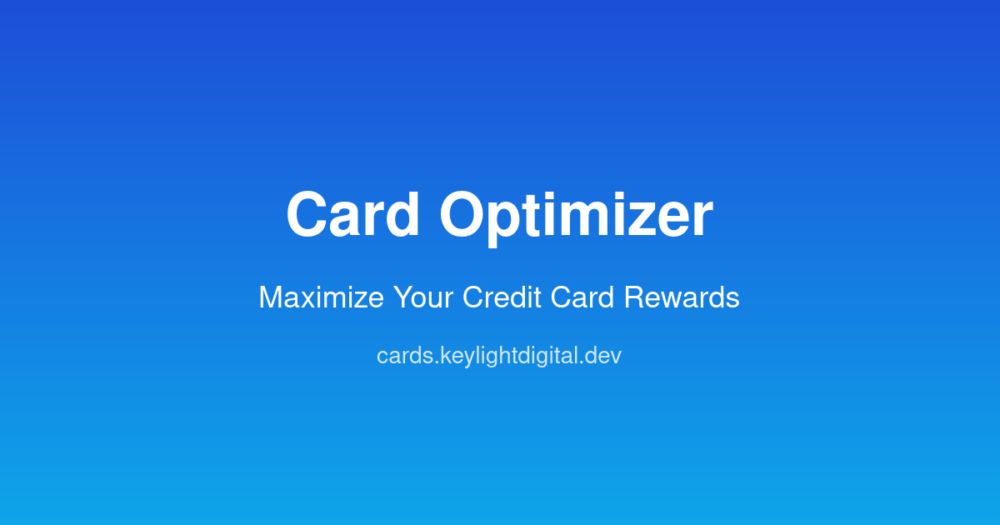

# Card Optimizer

**Maximize your credit card rewards — free, private, and runs entirely in your browser.**

🔗 **Live demo:** [cards.keylightdigital.dev](https://cards.keylightdigital.dev)

Upload your transaction history, let Card Optimizer analyze your spending patterns, and find out exactly which cards to use for every category — plus which new cards would earn you the most rewards.



---

## Features

- **CSV Upload & Auto-Detection** — Import transactions from Monarch, Copilot, Chase, Amex, Capital One, or any generic CSV. No account linking, no OAuth, no server upload.
- **Wallet Optimizer** — Select the cards you hold; the optimizer assigns each spending category to the best card and shows your total projected annual rewards.
- **New Card Recommendations** — Ranked by net annual value (rewards minus fees, sign-up bonus amortized over 2 years). Only shows cards with a positive net value for your spending.
- **Wallet Builder** — Find the optimal 2–4 card combination from 20+ cards in the catalog for your specific spending pattern.
- **Card Catalog** — Browse and search all supported cards with full reward structures, annual fees, and apply links.
- **Share Links** — Encode your spending summary and wallet selection in a URL hash for sharing. No PII — only category totals and card IDs.
- **100% Private** — All processing is client-side. Transaction data never leaves your browser.

---

## Tech Stack

| Layer | Technology |
|-------|-----------|
| Frontend | React 18 + TypeScript + Tailwind CSS |
| Build | Vite |
| Routing | React Router v6 |
| CSV parsing | PapaParse |
| Icons | Lucide React |
| Hosting | Cloudflare Pages |
| Card database | Cloudflare D1 (SQLite) |
| Smoke tests | Playwright |

---

## Running Locally

### Frontend only (no database needed)

```bash
npm install
npm run dev
```

Opens at `http://localhost:5173`. Card catalog is served from the static bundle (`seed/cards.json`), so the wallet optimizer, recommendations, and builder all work without a backend.

### Full stack with D1

Requires [Wrangler](https://developers.cloudflare.com/workers/wrangler/) and a Cloudflare account.

```bash
# 1. Create local D1 databases
npx wrangler d1 create card-optimizer-db

# 2. Run migrations
npx wrangler d1 execute card-optimizer-db --local --file=database/schema.sql

# 3. Seed cards
npx tsx seed/seed.ts > /tmp/seed.sql
npx wrangler d1 execute card-optimizer-db --local --file=/tmp/seed.sql

# 4. Start the local dev server with D1
npm run dev:backend
```

Opens at `http://localhost:8788`.

### Running tests

```bash
npx playwright install chromium --with-deps
npm test
```

By default, tests run against `http://localhost:8788`. Set `BASE_URL` to target staging or prod:

```bash
BASE_URL=https://cards.keylightdigital.dev npm test
```

---

## Privacy

Card Optimizer processes all data client-side:

- Transaction CSVs are parsed in the browser using PapaParse — nothing is uploaded
- Spending summaries are stored in `localStorage` only
- No cookies, no tracking pixels, no analytics
- Card selections and spending data never leave your device

See the [Privacy Policy](https://cards.keylightdigital.dev/privacy) for full details.

---

## License

MIT — see [LICENSE](LICENSE)

Built by [Keylight Digital LLC](https://keylightdigital.com)
